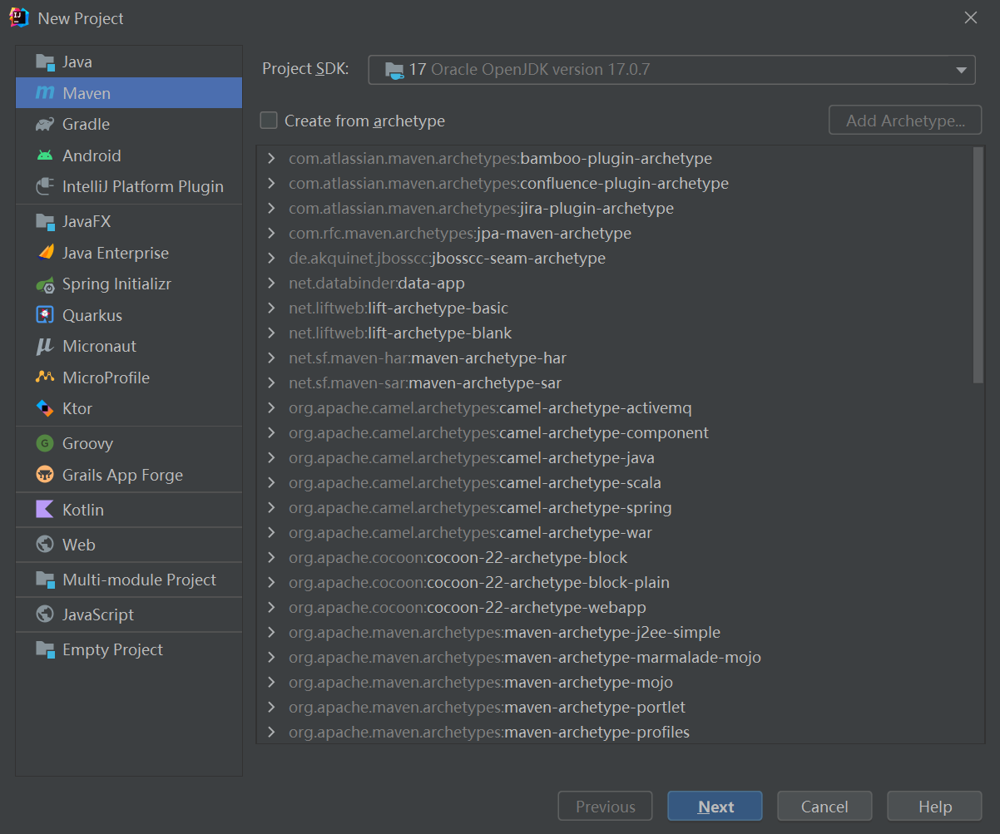

# 后端模板搭建记录


## 技术栈

- Spring 6
- SpringMVC 6
- SpringBoot 3
- Mybatis Plus （Mybatis的升级版）
- SpringSecurity 6.1 + jwt 做权限校验
- MySQL 8 数据存储


## 搭建项目

搭建项目一般来说有下面四种方式

1. Spring Initializer 网站初始化
2. IDEA内部进行Spring Initializer初始化

3. Github拉取SpringBoot模板
4. 搭建空项目，手动引入依赖


这里我选择了搭建一个空项目，手动引入依赖


### 创建空项目

<center></center>

创建一个空的maven项目即可


### 导入依赖

在pom.xml文件中导入所需依赖

```xml
	<parent>
        <artifactId>spring-boot-starter-parent</artifactId>
        <groupId>org.springframework.boot</groupId>
        <version>3.1.2</version>
    </parent>

    <dependencies>
        <dependency>
            <groupId>org.springframework.boot</groupId>
            <artifactId>spring-boot-starter</artifactId>
        </dependency>

        <dependency>
            <groupId>org.springframework.boot</groupId>
            <artifactId>spring-boot-starter-web</artifactId>
        </dependency>

        <dependency>
            <groupId>org.springframework.boot</groupId>
            <artifactId>spring-boot-starter-security</artifactId>
        </dependency>

        <dependency>
            <groupId>org.projectlombok</groupId>
            <artifactId>lombok</artifactId>
        </dependency>

        <!--数据库-->
        <dependency>
            <groupId>com.mysql</groupId>
            <artifactId>mysql-connector-j</artifactId>
        </dependency>

        <dependency>
            <groupId>com.baomidou</groupId>
            <artifactId>mybatis-plus-boot-starter</artifactId>
            <version>3.5.2</version>-->
        </dependency>

        <dependency>
            <groupId>org.mybatis.spring.boot</groupId>
           <artifactId>mybatis-spring-boot-starter</artifactId>
            <version>2.3.0</version>
       </dependency>

        <dependency>
            <groupId>com.alibaba.fastjson2</groupId>
            <artifactId>fastjson2</artifactId>
            <version>2.0.14.graal</version>
        </dependency>

        <dependency>
            <groupId>com.auth0</groupId>
            <artifactId>java-jwt</artifactId>
            <version>4.2.0</version>
        </dependency>
    </dependencies>
```

需要注意一点，在导入完依赖后运行，我会发现application.yml文件不会进行build，也就是打包后的目录里不包含application.yml文件，所以我翻看了一些资料，发现还需要一个maven插件才行

```XML
<build>
    <plugins>
        <plugin>
            <groupId>org.springframework.boot</groupId>
            <artifactId>spring-boot-maven-plugin</artifactId>
            <version>3.1.2</version>
        </plugin>
    </plugins>
</build>
```


### 配置Security

首先是最基本的，对security过滤器链的一个配置，主要作用是判断哪些路径需要验证，哪些路径不需要验证，以及登录成功和失败等方法的一些回调函数

```java
@Bean
public SecurityFilterChain filterChain(HttpSecurity http) throws Exception {
    //除了api auth后的请求都需要进行登录验证
    return http
            .authorizeHttpRequests(conf -> conf
                    .requestMatchers("/api/auth/**")
                    .permitAll()
                    .anyRequest()
                    .authenticated())
            //配置登录接口
            .formLogin(conf -> conf
                    .loginProcessingUrl("/api/auth/login")
                    //登陆成功回调
                    .successHandler(this::onAuthenticationSuccess)
                    //登陆失败回调
                    .failureHandler(this::onAuthenticationFailure)
            )
            //配置登出接口
            .logout(conf -> conf
                    .logoutUrl("/api/auth/logout")
                    //登出成功回调
                    .logoutSuccessHandler(this::onLogoutSuccess)
            )
            //关闭csrf
            .csrf(AbstractHttpConfigurer::disable)
            //不使用Session进行状态管理
            .sessionManagement(conf -> conf.sessionCreationPolicy(SessionCreationPolicy.STATELESS))
            //配置过滤器
            .addFilterBefore(filter, UsernamePasswordAuthenticationFilter.class)

            .exceptionHandling(conf -> conf
                    //认证失败回调
                    .authenticationEntryPoint(this::onAuthenticationFailure)
                    //没有权限回调
                    .accessDeniedHandler(new AccessDeniedHandler() {
                        @Override
                        public void handle(HttpServletRequest request, HttpServletResponse response, AccessDeniedException accessDeniedException) throws IOException, ServletException {

                        }
                    }))
            .build();
}
```


### 配置jwt

jwt的作用是将登录成功后的用户信息进行一个加密，作为一个token，替代了原先的session进行状态管理，前端请求的时候带上token，就可以利用jwt进行解析，获取到用户信息等数据，判断用户是否登录等

```java
@Component
public class JwtUtils {
    @Value("${spring.security.jwt.key:1}")
    String key;

    @Value("${spring.security.jwt.expire:1}")
    String expire;

    public UserDetails toUser(DecodedJWT jwt){
        Map<String, Claim> claims = jwt.getClaims();
        return User
                .withUsername(claims.get("username").asString())
                .authorities(claims.get("authorities").asList(GrantedAuthority.class))
                .password("*****")
                .build();
    }

    public Integer toId(DecodedJWT jwt){
        Map<String, Claim> claims = jwt.getClaims();
        return claims.get("id").asInt();
    }

    public DecodedJWT resolveJwt(String token){
        String convertToken = this.convert(token);

        if(convertToken == null){
            return null;
        }

        Algorithm algorithm = Algorithm.HMAC256(key);
        JWTVerifier jwtVerifier = JWT.require(algorithm).build();
        try {
            DecodedJWT verify = jwtVerifier.verify(convertToken);
            Date expiresAt = verify.getExpiresAt();
            return new Date().after(expiresAt) ? null : verify;
        }catch (JWTVerificationException e){
            return null;
        }

    }

    public String createJwt(UserDetails details, int id, String username){
        Algorithm algorithm = Algorithm.HMAC256(key);

        return JWT
                .create()
                .withClaim("id", id)
                .withClaim("username", username)
                .withClaim("authorities", details.getAuthorities().stream().map(GrantedAuthority::getAuthority).toList())
                .withExpiresAt(expireTime())
                .withIssuedAt(new Date())
                .sign(algorithm);
    }

    public Date expireTime(){
        Calendar calendar = Calendar.getInstance();

        calendar.add(Calendar.HOUR, Integer.parseInt(expire) * 24);

        return calendar.getTime();
    }

    private String convert(String token){
        if(token == null || !token.startsWith("Bearer ")){
            return null;
        }

        return token.substring(7);
    }
}

```


### jwt过滤器配置

在配置完jwt后，我们还需要配置一个过滤器，用于判断前端是否带了token，如果带了就要对其进行解析，对其进行权限校验等操作，然后让后续的过滤器都放行，如果没带上token，直接放行即可

```java
@Component
public class JwtAuthorizeFilter extends OncePerRequestFilter {
    @Resource
    private JwtUtils jwtUtils;
    @Override
    protected void doFilterInternal(HttpServletRequest request, HttpServletResponse response, FilterChain filterChain) throws ServletException, IOException {

        String token = request.getHeader("Authorize");

        DecodedJWT decodedJWT = jwtUtils.resolveJwt(token);
        if(decodedJWT != null){
            UserDetails userDetails = jwtUtils.toUser(decodedJWT);
            UsernamePasswordAuthenticationToken authenticationToken =
                    new UsernamePasswordAuthenticationToken(userDetails, null, userDetails.getAuthorities());

            authenticationToken.setDetails(new WebAuthenticationDetailsSource().buildDetails(request));

            SecurityContextHolder.getContext().setAuthentication(authenticationToken);

            request.setAttribute("id", jwtUtils.toId(decodedJWT));
        }

        filterChain.doFilter(request, response);
    }
}
```

注意，SecurityContextHolder.getContext().setAuthentication()方法的作用是将认证后的authenticationToken放入上下文，这样下面的过滤器就会认为已经校验过登录权限等，不会对其进行拦截

记得配置完过滤器后还要去Security配置里将过滤器加上，并且加在UserName那个过滤器之前，因为Username过滤器就是对用户登录权限进行判断的，我们先它一步判断，后续就它就不会再去判断了

### 封装通用返回类

这一步就没什么好说的，直接写即可

```java
public record RestBean<T>(int code, T data, String message) {
    public static <T> RestBean<T> success(T data){
        return new RestBean<>(20000, data, "success");
    }

    public static <T> RestBean<T> success(){
        return success(null);
    }

    public String asJsonString(){
        //JSONWriter.Feature.WriteNulls 保证data就算是null也会进行序列化
        return JSONObject.toJSONString(this, JSONWriter.Feature.WriteNulls);
    }

    public static <T> RestBean<T> failure(int code,String message){
        return new RestBean<>(code, null, message);
    }
}
```

这里使用了record，简化开发

